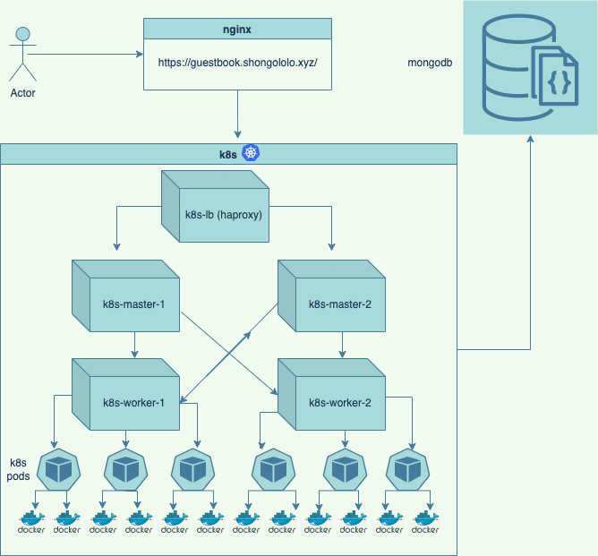

# Kartoza Technical Assessment

Provision a High Availability Multi Master Kubernetes Cluster using Vagrant, Virtualbox and Ansible with the following configuration:

* 2 Kubernetes master nodes that manage the cluster
* 2 Kubernetes worker nodes where the Docker containers will be deployed to
* 1 HAProxy Load Balancer to achieve High Availability across the master nodes
* 1 MongoDB database server to persist data
* 1 nginx reverse proxy to provide SSL termination



With a default Kubernetes configuration, no external IP addresses are assigned when a LoadBalancer service is created.

Fortunately [MetalLB](https://metallb.universe.tf/) solves this problem, and has been implented to allow external IP addresses to be assigned to Load Balancers in the Kubernetes Cluster.

The configuration can be viewed on [Github](https://github.com/ashleykleynhans/kartoza/blob/master/k8s/metallb-config.yml).

## Requirements

At least the following hardware resources will be required on the host machine that will be running the VirtualBox guest VMs:

| VM           | CPU | Memory |
|--------------|-----|--------|
| k8s-lb       |  1  | 512MB  |
| k8s-master-1 |  2  | 2GB    |
| k8s-master-2 |  2  | 2GB    |
| k8s-worker-1 |  1  | 512MB  |
| k8s-worker-2 |  1  | 512MB  |
| db           |  1  | 512MB  |
| nginx        |  1  | 512MB  |
|              |     |        |
| TOTAL        |  5  | 6.5GB  |

## Clone the GitHub Repository

Run the following command from the terminal to clone the GitHub Repository:

```bash
git clone https://github.com/ashleykleynhans/kartoza.git
```

## Install Required Software

Begin by installing the homebrew package manager, which works on both Mac
 and Ubuntu Linux.  May work on other Linux distributions but has not bee
n tested.

Run the following command from the terminal to install homebrew:

```bash
/bin/bash -c "$(curl -fsSL https://raw.githubusercontent.com/Homebrew/install/HEAD/install.sh)"
```

All of the remaining software can be installed by cloning the git repository and  running the setup script provided.

Run the setup script from the terminal to install the required software:

```bassh
./setup.sh
```

## Managing the Stack

Begin by ensuring that you are in the directory which the Github Repository was cloned to:

```
cd kartoza
```

### Starting the Stack

This will provision the following Virtual Box VMs using Vagrant and Ansible:

| VM Name        | Description                                       |
|----------------|---------------------------------------------------|
| k8s-lb         | HAProxy Load Balancer to ensure High Availability |
| k8s-master-1   | Kubernetes Primary Master Node                    |
| k8s-master-2   | Kubernetes Secondary Master Node                  |
| k8s-worker-1   | Kubernetes Worker where Docker Containers wll run |
| k8s-worker-2   | Kubernetes Worker where Docker Containers wll run |
| db             | MongoDB Database Server to persist data           |
| nginx          | Nginx Reverse Proxy to provide SSL termination    |


```bash
vagrant up
```

### Stopping the Stack

```bash
vagrant halt
```

### Deleting the Stack

```bash
vagrant destroy -f
```

## Accessing the Stack

### Website

[https://guestbook.shongololo.xyz/](https://guestbook.shongololo.xyz/)

### Health Check

[https://guestbook.shongololo.xyz/health/](https://guestbook.shongololo.xyz/health/)
